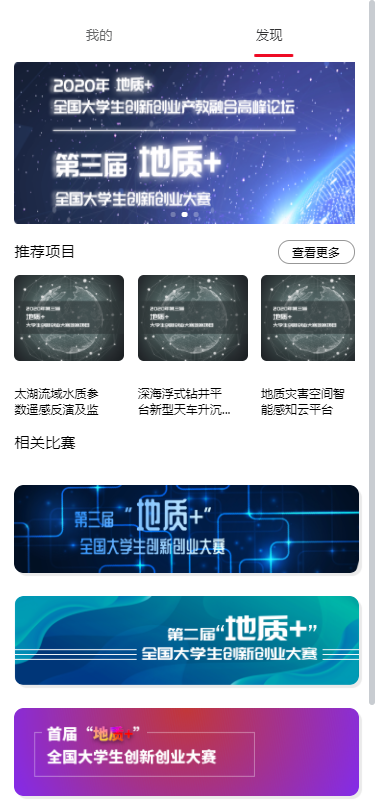
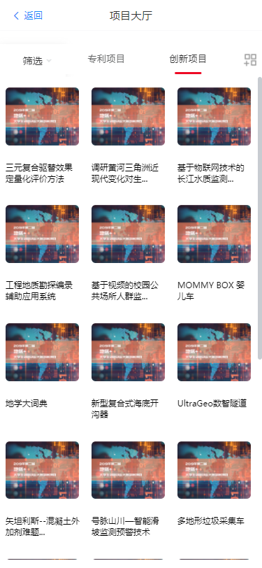
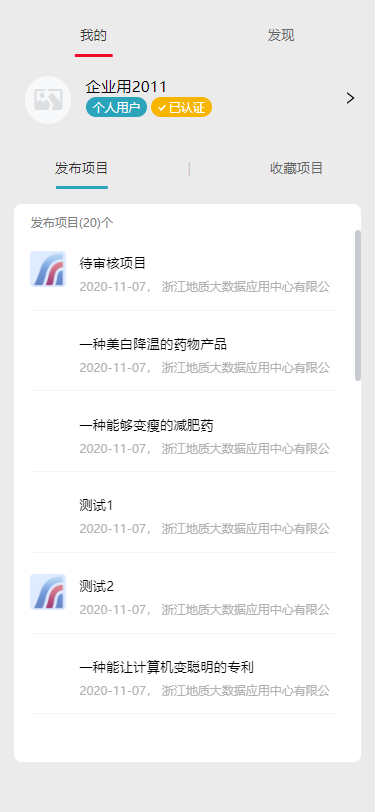
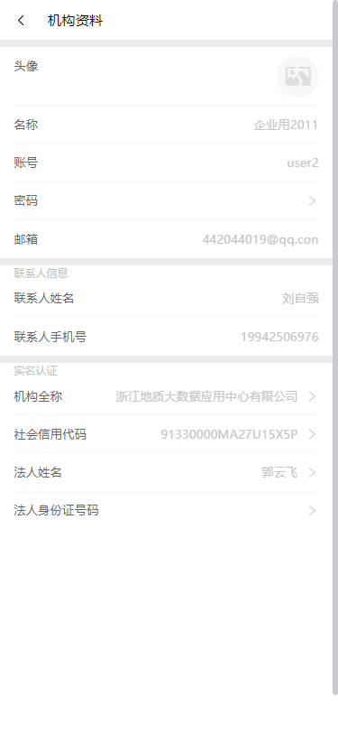
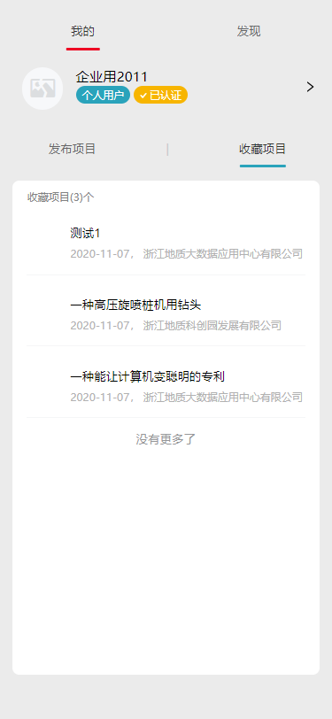
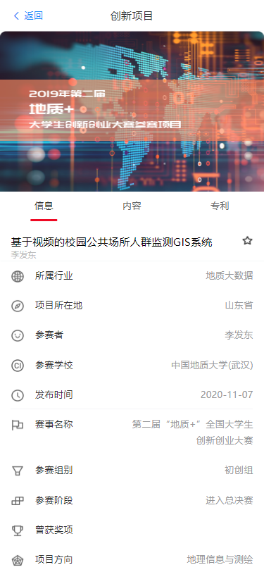
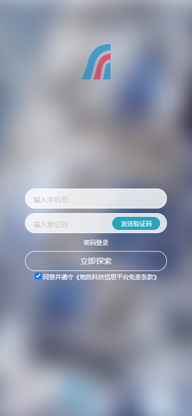

### 一、 浙江地质科创园H5
----

- 开始时间：2020年10月29号
- 结束时间：2020年11月24号

#### 技术栈：
- Vue 2.x (前端框架)
- Vuex (组件状态管理工具)
- Vue-Router (页面路由导航)
- Vant 2.x (UI框架)
- axios (异步接口请求)
- less (CSS预编译)
- keep-alive (组件保存状态)

#### 功能模块
- 1.登录模块
- 2.“我的”模块
- 3.首页及项目大厅

- 首页及项目大厅

  - 首页截图预览  
    

  - 功能点介绍
    - 最上方的导航栏：我的和首页自由切换；`<Tab><Tabs>`
    - 上方的轮播图功能：放置竞赛信息或者页面跳转引流；`<Swipe>`
    - 其次是项目推荐功能：展示推荐的项目，点击判断是否登录，登录后直接进入项目详情；`<swiper>`
    - 下方是相关比赛功能：展示相关比赛，使用原生+vue编写；

  - 项目大厅预览  
  

  - 功能点介绍
    - 最上方是导航栏：返回功能；`<NavBar>`
    - 上方是筛选功能+tab+筛选功能；`<van-dropdown-menu><Tab><van-popup>`
    - 下方是项目展示区： 下拉刷新，上拉加载；`<van-pull-refresh><van-list><van-grid>`

- “我的”模块

  - 我的截图预览(本地环境下截图)   
  

  - 功能点介绍
    - 首先是用户信息展示模块：头像、名称、用户类型、是否认证；点击`>`可以进入用户信息资料页面，如下图：
       
      * > 根据用户类型进入不同导航页面
    
    - 下面是一个Tab切换模块，用来展示用户发布的项目和收藏的项目
    * 这里使用了`<keep-alive>`和`actived`钩子函数  
    

- 项目详情模块

  - 截图预览(本地环境下截图)   
  

  - 功能点介绍
    - 上面展示轮播图
    - 下面分别展示
      * 信息模块
      * 内容模块
      * 专利模块
    - 在项目信息页可以收藏或取消收藏项目

- 登录模块
  - 登录截图预览     
  

  - 功能点介绍
    - 2种登录方式
      * 验证码登录
      * 密码登录
    - 注册模块
      - 个人用户注册
      - 机构用户注册
    - 使用RSA加密

#### 项目亮点

- 1.使用了Vue全家桶框架+vant可以快速、轻量的编写轻型H5项目。  
- 2.使用Vuex来管理状态，使得项目易于维护。
- 3.页面功能模块组件化，方便开发和以后扩展维护。
- 4.该项目是PC端项目的一个移动化的H5项目，目的在于用户可以使用移动设备就可以使用平台的基础功能。

#### 项目缺点

- 由于工期较短，前期策划不利导致多次改版，阻塞了开发进程！

### 二、 临安区地质灾害精细化管理系统
---

- 开始时间：2020年11月9号
- 结束时间：2020年12月14号

#### 技术栈
- Vue 2.x (前端框架)
- Vuex (状态管理工具)
- Vue-Router (路由管理工具)
- iview (UI框架)
- Echarts 4.0.4 (图表绘制工具)
- HighCharts (3D图表绘制工具)
- Leaflet (WebGIS交互工具)
- @supermap/iclient-leaflet 10.0.0-beta (superMap，云GIS网络客户端开发工具)
- axios (异步接口请求工具)
- less (CSS预编译语言)

#### 自述
- 我在完成科创园H5项目的基本开发后，H5进入测试环节。我开始从事临安区地质灾害精细化管理系统的不知道几期的开发之中，可以说经过我大约一个月的开发，项目已经和我接手时大不相同。
  - 首先首页的样式回炉重铸
  - 前台大模块新增了3大子模块（累到吐血）
  - 后台管理大模块新增了大约13个左右的导航页，对接了70多个接口（若干个加班的夜晚）
  - 调GIS地图和数据服务，来服务Web地图功能
  - 调后端服务来服务其他功能，比如Echarts和HighCharts绘图功能，iview数据展示等

- 我话讲完，谁赞同？谁反对？

#### 功能模块
- 这里只介绍我做的功能，若要细分怕是要分为前台模块和后台模块来说了。

##### 前台大模块
- 预警信息模块
- 灾后分析模块
- 应急指挥模块
- 数据驾驶舱模块

- 每个页面的操作基本上都差不多，区别就是首页多加了一些图层服务：气象、斜坡、适宜性等

##### 后台管理大模块
- 风险区管理
- 巡查员、网格员管理
- 灾险情信息管理
- 视频设备管理
- 物资仓库管理
- 避难场所管理
- 地灾专家库管理
- 应急设备管理
- 地灾巡查管理
- 应急撤离管理
- 灾情速报管理
- 单条数据反演管理
- 多条数据反演管理

#### 项目亮点
- 1.使用Vue+View UI快速搭建项目；
- 2.使用了若干的地图服务和leaflet API对地图进行操作；
- 3.该平台符合临安区对地灾防治的要求，从多方面，各个角度去处理地灾；
- 4.该平台图表并茂，功能繁多，数据详实。

#### 项目缺点
- 1.使用了天地图服务，而不是将临安区地图裁剪出来，单独发布服务。对前端绘制漂亮的地图造成困扰。
- 2.应急指挥模块的视频监控服务没有实现。

### 三、 浙江省地质第一大队数据监控台
---

- 开始时间：2020年12月8号
- 结束时间
  - 一期结束时间：2020年12月30号
  - 剩余工期：至今

#### 技术栈
- Vue 2.x (前端框架)
- Vuex (状态管理工具)
- Vue-Router (路由导航管理工具)
- axios (异步接口请求工具)
- Echarts (绘图工具)
- HighCharts (3D图绘制工具)
- less (CSS预编译语言)

#### 项目自述
- 这又是一个工期很赶，策划失败，不知所云的项目，一开始说是做一个公司内部使用的OA系统。当时我就惊呆了，2个前端2个后端就要干一套OA出来，做梦呢！
- 结果等产品费尽脑汁想出来之后，才发现又是一个临安地灾系统（前台挂几个大屏页面，后面接一个后台管理模块）。
- 对该系统就不做评价了，上午刚开完演示会议，要回炉重铸了，哈哈哈哈哈哈哈。

#### 功能模块

- 首页
  - ECharts绘制的中国地图，及一些操作
  - 若干组件展示若干功能

- 项目详细
  - ECharts绘制的中国地图，及一些操作
  - 若干组件展示若干功能
  - Vuex负责状态管理和数据流动
  - global Bus 负责状态改变更新图表数据

- 人员信息（另外一个同事做的）

#### 项目亮点

- 暂不做评价

#### 项目缺点

- 暂不做评价
