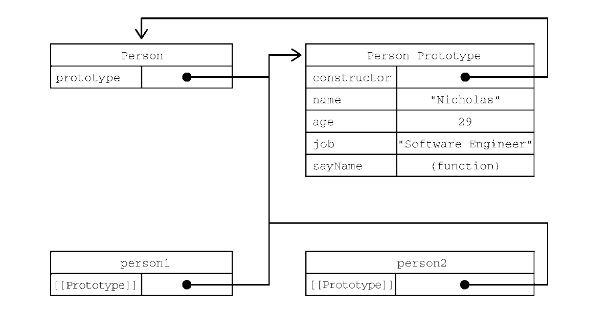
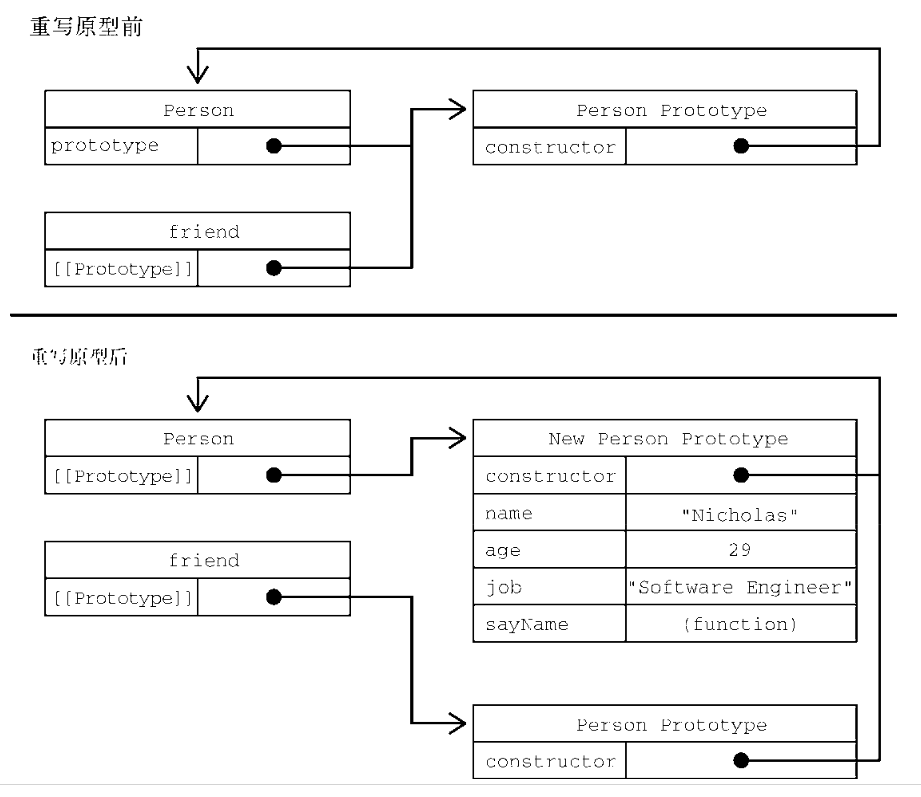

> 使用Object构造函数或对象字面量可以方便地创建对象，但这些方式明显不足：创建具有同样接口的多个对象需要重复编写很多代码。

- ES5并没有正式支持面向对象的结构，比如类或继承。
- ES6的类都仅仅是封装了Es5.1构造函数加原型继承的语法糖而已。

- 工厂模式
- 构造函数模式
- 原型模式
- 对象迭代

### 工厂模式

- 工厂模式是一种设计模式，广泛应用于软件工厂领域，用于抽象创建特定对象的过程。

```js
  function createPerson(name, age, job) {
    let o= new Object();
    o.name = name;
    o.age = age;
    o.hob = job;
    o.sayName = function() {
      console.log(this.name);
    };
    return  o;
  }

  let person1 = createPerson('yl', 25, 'F2E');
  let person2 = createPerson('xl', 25, 'EE');
```

- 这种工厂模式虽然可以解决创建多个类似对象的问题，但没有解决对象标识问题（即新创建的对象是什么类型）。

### 构造函数模式
- ES的构造函数适用于创建特定类型对象的。像Object和Array这样的原生构造函数，运行时可以直接在执行环境中使用。当然也可以自定义构造函数，以函数的形式为自己的对象类型定义属性和方法。

```js
  // 将上面的工厂模式改成构造函数
  function Person(name, age, job) {
    this.name = name;
    this.age = age;
    this.job = job;
    this.sayName = function() {
      console.log(this.name);
    };
  }
  let p1 = new Person('yk', 29, 'SE');

```

- Person()构造函数与createPerson()工厂函数的区别：
  - 没有显式地创建对象
  - 属性和方法直接赋值给了this
  - 没有return

- 构造函数，函数名首字母大写，依此来区分普通函数

- 要从创建Person实例，应使用new操作符，以这种方式调用构造函数会执行如下操作：
  1. 在内部创建一个新对象
  2. 这个新对象内部的`[[Prototype]]`特性被赋值为构造函数的prototype属性。
  3. 构造函数内部的this被赋值为这个新对象（this指向新对象）。
  4. 执行构造函数内部的代码（给新对象添加属性）。
  5. 如果构造函数返回非空对象，则返回该对象；否则，返回刚创建的新对象

- person.constructor == Person
  - constructor本来是用来标识对象类型的。
  - instanceof操作符是确定对象类型更可靠的方式。

- 自定义对象都继承自Object

- 构造函数不一定要写成函数声明的形式。赋值给变量的函数表达式也可以表示构造函数。
  ```js
    let Person = function(name, age, job){
      this.name = name;
      this.age = age;
      this.job = job
    }
  ```

- 在实例化时，如果不想传参数，那么构造函数后面的括号可加可不加。只要有new操作符，就可以调用相应的构造函数。

1. 构造函数也是函数
   - 构造函数与普通函数唯一的区别就是调用方式不同。
   - 除此之外，构造函数也是函数。并没有把某个函数定义为构造函数的特殊语法。
   - 任何函数只要使用new操作符调用就是构造函数，而不使用new操作符调用的函数就是普通函数。

   ```js
    // 作为构造函数
    let person = new Person('yl', 29, 'SE');
    person.sayName(); // yl

    // 作为函数调用
    Person('yl', 29, 'SE'); // 挂载到window对象
    window.syName(); // 'yl'

    // 在另一个对象的作用域中调用
    let o = new Object();
    Person.call(o, 'kk', 25, 'Nurse');
    o.sayName(); // 'kk'
   ```

   - 第一种就是典型的构造函数调用方式
   - 第二种没有使用new操作符，结果会将属性和方法添加到window对象上。在调用一个函数而没有明确设置this值得情况下（没有作为对象的方法调用，或没有使用call()/apply()调用），this始终指向Global对象。
   - 第三个，这里通过call()或apply()调用函数，同时将特定对象指定为作用域。

2. 构造函数的问题
   - 构造函数的主要问题在于，其定义的方法会在每个实例上都创建一遍。
   - 因此对前面的例子而言，person1和person2都有名为sayName()的方法，但这两个方法不是同一个Function实例。
   - 我们知道，ECMAScript中的函数是对象，因此每次定义函数时，都会初始化一个对象。

   ```js
    function Person(name, age, job) {
      this.name = name;
      this.age = age;
      this.job = job;
      this.asyName = new Function("console.log(this.name)"); // 逻辑等价
    }
   ```

   - 因为都做一样的事，所以没必要定义两个不同的Function实例。况且，this对象可以把函数与对象的绑定推迟到运行时。
   - 可以将函数转移到构造函数外部；但这样的话全局作用域就被搞乱了。

### 原型链模式

- 每个函数都会创建一个prototype属性，这个属性是一个对象，包含应该由特定引用类型的实例共享的属性和方法。
- 实际上，这个对象就是通过调用构造函数创建的对象的原型。
- 使用原型对象的好处是，在它上面定义的属性和方法可以被对象实例共享。
- 原来在构造函数中直接赋给对象实例的值，可以直接赋值给它们的原型。

```js
  function Person () {}
  Person.prototype.name = 'luke';
  Person.prototype.age = 29;
  Person.prototype.job = 'SE';
  Person.prototype.sayName = function () {
    console.log(this.name);
  };

let person 1 = new Person();
person1.sayName(); // 'luke'

let person2 = new Person();
person2.sayName(); // 'luke'

console.log(person1.sayName === person2.sayName); // true
```

- 使用函数表达式也是可以的；
```js
  let Person = function () {};

  // 下面操作相同
```

- 所有属性和方法都直接添加到了Person的prototype属性上，构造函数体种啥也没有。但调用构造函数创建的新对象仍然拥有相应的属性和方法。
- 使用原型模式定义的属性和方法是由所有实例共享的。

1. 理解原型
   - 只要创建一个函数，就会按照特定的规则为这个函数创建一个prototype属性（指向原型对象）。默认情况下，所有原型对象自动获得一个名为constructor的属性，指回与之关联的构造函数。对于前面的例子，Person.prototype.constructor指向Person.
   - 在自定义构造函数时，原型对象默认只会获得constructor属性，其他的所有方法都继承自Object。每次调用构造函数创建一个新实例，这个实例的内部`[[prototype]]`指针就会被赋值为构造函数的原型对象。
     - 脚本种没有访问这个特性的标准方式，但Chrome和Firefox会在每个对象上暴露__proto__属性，通过这个属性可以访问对象的原型。
   - 【关键】实例与构造函数原型之间有直接的联系，但实例与构造函数之间没有。

  - 通过下面的代码来理解原型的行为：

  ```js
    // 构造函数可以是函数表达式或函数声明
    function Person () {}

    // 声明之后，构造函数就有了一个与之关联的原型对象；
    typeof Person.prototype; // 'object'
    Person.prototype; // {constructor: f Person(), __proto__: Object}

    // 如前所述，构造函数有一个prototype属性，
    // 引用其原型对象，而这个原型对象也有一个
    // constructor属性，引用这个构造函数
    // 换句话说，两者循环引用：

    Person.prototype.constructor === Person; // true

    // 正常的原型都会终止于Object的原型对象
    // Object原型的原型是null
    Person.prototype.__proto__ === Object.prototype; // true
    Person.prototype.__proto__.constructor === Object; // true
    Person.prototype.__proto__.__proto__ === null; // true

    Person.prototype.__proto__; // { constructor: f Object(), toString: ... , hasOwnProperty:..., ...}

    let p1 = new Person();
    let p2 = new Person();

    // 构造函数、原型对象、实例是三个完全不同的对象
    p1 !== Person; // true
    p1 !== Person.prototype; // true
    Person.prototype !== Perosn; // true

    // 实例通过__proto__连接到原型对象，它实际上指向隐藏特性`[[Prototype]]`
    // 构造函数通过prototype属性连接到原型对象
    // 实例与构造函数没有直接联系，与原型对象有直接联系

    p1.__proto__ === Person.prototype; // true
    p1.__proto__.constructor === Person; // true

    // 同一个构造函数创建的两个实例共享同一个原型对象
    person1.__proto__ === person2.__proto__; // true

    // instanceof 检查实例的原型链中是否包含指定构造函数的原型
    p1 instanceof Person // true
    p1 instanceof Object // true
    Person.prototype instanceof Object // true 
  ```

  - 对于上例，Person构造函数、Person.prototype与实例之间的关系图：
    - 

    - 上图展示了Person构造函数、Person的原型对象和Person现有两个实例之间的关系。
    - 注意，Person.prototype指向原型对象，而Person.prototype.contructor指回Person构造函数。
    - 原型对象包含constructor属性和其他后来添加的属性。
    - Person的两个实例person1和person2都只有一个内部属性指回Person.prototype，而且两者都与构造函数没有直接联系。
    - 另外要注意，虽然这两个实例都没有属性和方法，但person1.sayName()可以正常调用。这是由于对象属性查找机制的原因。

  - isPrototypeOf()方法确定两个对象之间的这种关系。本质上，isPrototypeOf()会在传入参数的`[[Prototype]]`指向调用它的对象时返回true。

  ```js
    Person.prototype.isPrototypeOf(p1); // true
  ```

  - 因为p1内部都有链接指向Person.prototype，所以返回true。

  - ES的Object类型有一个方法叫Object.getPrototypeOf()，返回参数的内部特性`[[Prototype]]`的值。
  
  ```js
    Object.getPrototypeOf(p1) == Person.prototype; //true
    Object.getPrototypeOf(p1).name; // 'luke'
  ```

  - Object类型还有一个setPrototypeOf()方法，可以向实例的私有特性`[[Prototype]]`写入一个新值。这样就可以重写一个对象的原型继承关系：

  ```js
    let biped = {
      numLegs: 2
    };
    let person = {
      name: 'Matt'
    };

    Object.setPrototypeOf(person, biped);

    person.name; // Matt
    person.numLegs; // 2
    person.getPrototypeOf(person) === biped; // true
  ```

  - 【警告】Object.setPrototypeOf()可能会严重影响代码的性能。
  - 为了避免使用Object.setPrototype()可能造成的性能下降，可以通过Object.create()来创建一个新对象，同时为其指定原型：

  ```js
    let biped = {
      numLegs: 2
    };

    let person = Object.create(biped);
    person.name; // 'Matt'
    person.numLegs; // 2
    Object.getPrototypeOf(person) === biped // true
  ```

2. 原型层级
   - 在通过对象访问属性时，会按照如下步骤进行搜索：
     - 1.搜索对象实例本身，若发现给定的名称，返回该名称对应的值。如果没有发现则进行第二部；
     - 2.搜索会沿着指针进入原型对象，然后在原型对象上找到属性后，再返回对应的值。

  - constructor属性只存在于原型对象，因此通过实例对象也是可以访问的。

  - 可以通过实例读取原型对象上的值，但不能通过实例重写这些值。如果在实例上添加一个与原型对象中同名的属性，那就会在实例上创建这个属性，这个属性会遮住shadow原型对象上的属性。

  - 只要给对象实例添加一个属性，这个属性就会遮蔽（shadow）原型对象上的同名属性，也就是虽然不会修改它，但会屏蔽对它的访问。即使在实例上把这个属性设置为null，也不会恢复它和原型的联系。不过，使用delete操作符可以完全删除实例上的这个属性，从而让标识符解析过程能够继续搜索原型对象。

  - hasOwnProperty()方法用于确定某个属性是在实例上还是在原型对象上。该方法继承自Objectde1,会在属性存在于调用它的对象实例上时返回true：

  ```js
    function Person () {}

    Person.prototype.name = 'luke';
    Person.prototype.age = 26;
    Person.prototype.job = 'SE';
    Person.prototype.sayName = function () {
      console.log(this.name)
    };

    let p1 = new Person();
    let p2 = new Person();
    p1.hasOwnProperty('name'); // false

    p1.name = 'Greg';
    p1.name; // 'Greg'
    p1.hasOwnProperty('name'); // true , name来自实例
  ```

  - ECMAScript的Object.getOwnPropertyDescriptor()方法只对实例属性有效。
  - 要取得原型属性的描述符，就必须直接在原型对象上调用Object.getOwnPropertyDescriptor()

3. 原型和 in 操作符
  - 使用in操作符：
    - 单独使用，in 操作符会在可以通过对象访问指定属性时返回true，无论该属性是在实例上还是在原型上。
    - 在for-in循环中使用。

  ```js
    function Person () {}

    Person.prototype.name = 'luke';
    Person.prototype.age = 26;
    Person.prototype.job = 'SE';
    Person.prototype.sayName = function () {
      console.log(this.name)
    };

    let p1 = new Person();
    let p2 = new Person();

    p1.hasOwnProperty('name'); // false 来自原型对象
    "name" in p1; // true

    p1.name = '李云龙';
    p1.hasOwnProperty('name'); // true 来自实例
    'name' in p1; // true

    delete p1.name; 
    p1.hasOwnProperty('name'); // false
    'name' in p1; // true
  ```

  - name随时可以通过实例或通过原型访问到。因此，调用"name" in persoon1时始终返回true，无论这个属性是否在实例上。如果要确定某个属性是否存在于原型上，则可以像下面这样同时使用hasOwnProperty()和in操作符:

  ```js
    function hasPrototypeProperty(object, name) {
      return !object.hasOwnProperty(name) && (name in object);
    }
  ```

  - 只要in操作符返回true且hasOwnProperty()返回false，就说明该属性是一个原型属性.

  - 在for-in循环中使用in操作符时，可以通过对象访问且可以被枚举的属性都会返回，包括实例属性和原型属性。
  - 遮蔽原型中不可枚举（[[Enumerable]]特性被设置为false）属性的实例属性也会在for-in循环中返回，因为默认情况下开发者定义的属性都是可枚举的。

  - 使用Object.keys()方法来获取对象上所有可枚举的实例属性。该方法接收一个对象作为参数，返回包含该对象所有可枚举属性名称的字符串组。

  ```js
    function Person () {}

    Person.prototype.name = 'luke';
    Person.prototype.age = 26;
    Person.prototype.job = 'SE';
    Person.prototype.sayName = function () {
      console.log(this.name)
    };

    let keys = Object.keys(Person.prototype); // ['name','age,'job','sayName']

    let p1 = new Person();
    p1.name = 'dd';
    p1.age = 27;
    let p1Keys = Object.keys(p1); // ['name', 'age']
    // 而在Person的实例上调用时，Object.keys()返回的数组中只包含"name"和"age"两个属性
  ```

  - 如果想列出所有实例属性，无论是否可以枚举，都可以使用Object.getOwnPropertyNames();
  - constructor属性不可枚举。
  - ES6新增Symbol之后，新增了Object.getOwnPropertySymbols()方法，该方法与Object.getOwnPropertyNames()类似。

  ```js
    let k1 = Symbol('k1'), k2 = Symbol('k2');
    let o = {
      [k1]: 'k1',
      [k2]: 'k2'
    };

    Object.getOwnPropertySymbols(o); // [Symbol(k1), Symbol(k2)]
  ```

4. 属性枚举顺序
  - for-in循环
  - Object.keys()
  - Object.getOwnPropertyNames()
  - Object.getOwnPropertySymbols()
  - Object.assign()
  - 在属性枚举顺序方面有很大不同。
  - for-in循环和Object.keys()的枚举顺序是不确定的。取决于js引擎。
  - Object.getOwnPropertyNames()、Object.getOwnPropertySymbols()和Object.assign()的枚举顺序是确定性的。
    - 先以升序枚举数值键，
    - 然后以插入顺序枚举字符串和符号键。
    - 在对象字面量中定义的键以它们逗号分隔的顺序插入。

  ```js
    let k1 = Symbol('k1'), k2 = Symbol('k2');
    let o = {
      1: 1,
      first: 'first',
      [k1]: 'k1',
      second: 'second',
      0: 0
    };
    o[k2] = 'sym2';
    o[3] = 3;
    o.third = 'third';
    o[2] = 2

    Object.getOwnPropertyNames(o); 
    // ['0', '1', '2', '3', 'first', 'second', 'third']

    Object.getOwnPropertySymbols(o);
    // [symbol(k1), symbol(k2)]

    object.assign(o);
    /**
        {
          '1': 1,
          '2': 2,
          '3': 3,
          'first': 'first',
          'second': 'second'
          third: 'third',
          [Symbol(k1)]: 'k1',
          [Symbol(k2)]: 'sym2'
        }
    */
  ```
### 对象迭代

- 在JS有史以来的大部分时间内，迭代对象属性都是一个难题。
- ES2017新增了两个静态方法，用于将对象内容转换为序列化的————更重要的是可迭代的————格式
- Object.values()和Obejct.entries()都接收一个对象，返回它们的内容的数组。
- Object.values()返回的是对象值得数组，
- Object.entries()返回键值对数组

```js
  const o = {
    foo: 'bar',
    baz: 1,
    qux: {}
  };

  Object.values(o); // ['bar', 1, {}]

  Object.entries(o); // [['foo', 'bar'], ['baz', 1], ['qux', {}]]
```

- 【注意】非字符串属性会被转换为字符串输出。另外，这两个方法执行对象的浅复制。
- 符号属性会被忽略

1. 其他原型语法
  - 每次定义一个属性或方法都会把Person.prototype重写一遍。为了减少代码冗余，也为了从视觉上更好地封装原型功能，直接通过一个包含所有属性和方法的对象字面量来重写原型成为了一种常见的做法。

  ```js
    function Person () {}

    Person.prototype = {
      name: 'luke',
      age: 29,
      job: 'SE',
      sayName() {
        //...
      }
    };
  ```
  - 这样的写法，只有一个问题。就是Person.prototype的constructor属性不指向Person了。上面的写法相当于重写了prototype对象，因此constructor属性也就指向了安全不同的新对象（Object构造函数），不再指向原来的构造函数。
  - 虽然instanceof操作符还能可靠地返回值，但我们不能再依靠constructor属性来识别类型了.

  - 如果constructor的值很重要，为了避免上述问题，我们重写时要专门设置constructor的值。
  
  ```js
    function Person () {}

    Person.prototype = {
      constructor: Person,
      name: 'luke',
      age: 29,
      job: 'SE',
      sayName() {
        //...
      }
    };
  ```

  - 但要注意，以这种方式恢复constructor属性会创建一个`[[Enumerable]]`为true的属性。
  - 而原生constructor属性默认是不可枚举的。
  - 因此，如果你使用的是兼容ECMAScript的JavaScript引擎，那可能会改为使用Object.defineProperty()方法来定义constructor属性.

  ```js
    function Person () {}

    Person.prototype = {
      name: 'luke',
      age: 29,
      job: 'SE',
      sayName() {
        //...
      }
    };

    // 恢复constructor属性
    Object.defineProperty(Person.prototype, 'constructor', {
      enumerable: false,
      value: Person
    })
  ```

2. 原型的动态性
  - 因为从原型上搜索值的过程是动态的，所以即使实例在修改原型之前已经存在，任何时候对原型对象所做的修改也会在实例上反映出来。

  ```js
    let friend = new Person();

    Person.prototype.sayHi = function () {
      console.log('hi')
    }

    friend.sayHi(); // hi
  ```

  - 之所以会这样，主要原因是实例与原型之间松散的联系。
  - 在调用friend.sayHi()时，首先会从这个实例中搜索名为sayHi的属性。在没有找到的情况下，运行时会继续搜索原型对象。因为实例和原型之间的链接就是简单的指针，而不是保存的副本，所以会在原型上找到sayHi属性并返回这个属性保存的函数.

  - 重写整个原型会切断最初原型与构造函数的联系，但实例引用的仍然是最初的原型。记住，实例只有指向原型的指针，没有指向构造函数的指针。

  ```js
    function Person () {}

    let friend = new Person();

    Person.prototype = {
      constructor: Person. // 这里的constructor是可枚举的
      name: 'luke',
      age: 29,
      sayName() {
        // ...
      }
    };
    friend.sayName(); // error
  ```

  - 上例中，friend实例是在重写原型对象之前创建的。调用friend.sayName()的时候会导致错误。这是因为friend指向的原型还是最初的原型，而这个原型并没有syaName属性。
  - 

  - 重写构造函数上的原型之后再创建的实例才会引用新的原型。而在此之前的实例仍然会引用最初的原型。

3. 原生对象原型
  - 原型模式也实现了所有原生引用类型的模式。所有原生引用类型的构造函数都在原型上定义了实例方法。
  - Object
  - Array，例如sort()就定义在Array.prototype上
  - String，例如substring()定义在String.prototype上
  - 等

  - 通过原生对象的原型可以取得所有默认方法的引用，也可以给原生类型的实例定义新的方法。可以像修改自定义对象原型一样修改原生对象原型，因此随时可以添加方法。

  ```js
    // 给String包装类的实例添加一个startsWith()方法
    String.prototype.startsWith = function (text) {
      return this.indexOf(text) === 0;
    };

    let msg = "hello world!";
    msg.startsWith('hello'); // true
  ```

  - 不建议自接修改原生对象原型，而是创建一个自定义的类，继承原生类型。在自定义的类的基础上修改。

4. 原型的问题
   - 1.弱化了向构造函数传递初始化参数的能力，会导致所有实例默认都取得相同的属性。
   - 2.最主要的问题源自它的共享特性

  - 原型上的所有属性是在实例间共享的，这对函数来说比较合适。另外原始值的属性也还好，如前面例子中所示，可以通过在实例上添加同名属性来简单地遮蔽原型上的属性。真正的问题来自包含引用值的属性。

  ```js
    function Person() {}

    Person.prototype = {
      constructor: Person,
      name: 'luke',
      age: 29,
      job: 'SE',
      friends: ["Shelby", "Court"],
      sayName() {
        console.log(this.name)
      }
    };
    let p1 = new Person()
    let p2 = new Person()

    p1.friends.push('Van');
    p1.friends; // ['Shelby', 'Court', 'Van']
    p2.friendsl // ['Shelby', 'Court', 'Van']
    p1.friends === p2.friends; // true
  ```

  - 但一般来说，不同的实例应该有属于自己的属性副本。这就是实际开发中通常不单独使用原型模式的原因。