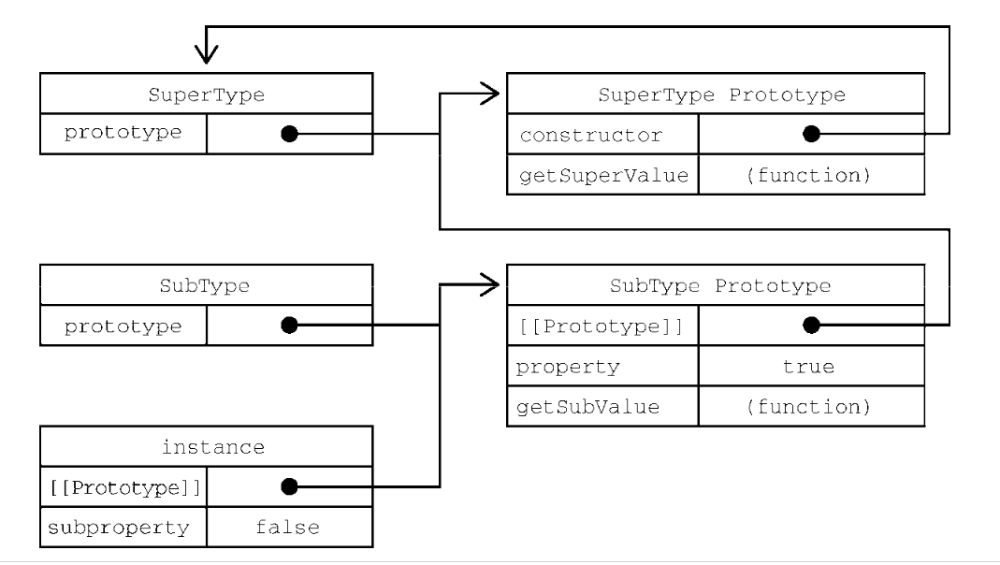
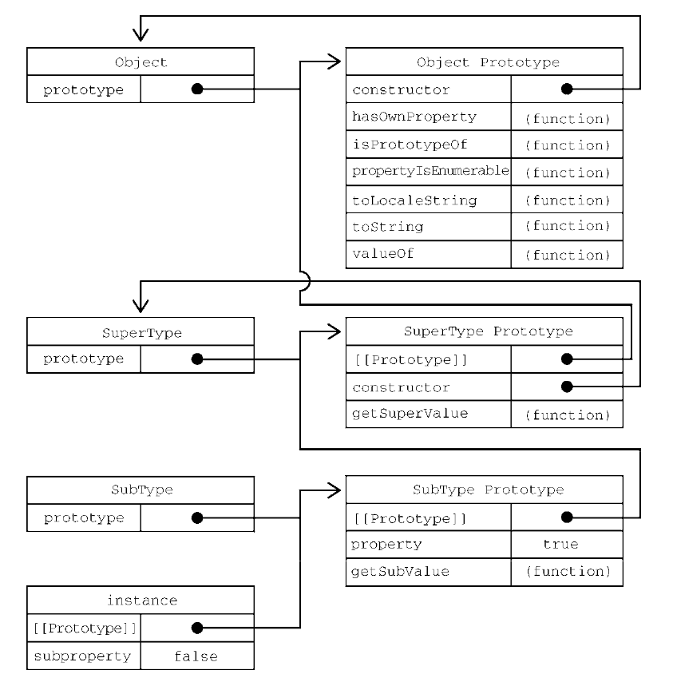

> 面向对象语言支持2种继承：接口继承和实现继承。前者只继承方法签名，后者继承实际的方法。、
> 接口继承在ES中是不可能实现的，因为函数没有签名。
> 实现继承是ES唯一支持的继承方式，主要是通过原型链实现的。

### 原型链

- ES把原型链定义为ES的主要继承方式。
  - 基本思想：通过原型继承多个引用类型的属性和方法。

- 构造函数、原型和实例的关系：
  - 每个构造函数都有一个原型对象，原型有一个constructor属性指回构造函数，而实例有一个内部指针指向原型。

- 若原型是另一个类型的实例，这就意味着这个原型本身有一个内部指针指向另一个原型，相应地另一个原型也有一个指针指向另一个构造函数。这样就在实例和原型之间构造了一条原型链。这就是原型链的基本构想。

- 实现原型链涉及如下代码模式：

```js
  function SuperType () {
    this.property = true;
  }

  SuperType.prototype.getSuperValue = function () {
    return this.property;
  }

  function SubType () {
    this.subproperty = false;
  }

  // 继承SuperType
  SubType.prototype = new SuperType();

  SubType.prototype.getSubValue = function () {
    return this.subproperty;
  }
  
  let instance = new SubType();
  console.log(instance.getSuperValue()); // true
```

- 这两个类型的主要区别就是SubType是通过创建SuperType的实例并将其赋值给自己的原型SubType.prototype实现了对SuperType的继承。
  - 这个赋值重写了SubType最初的原型，将其替换为SuperType的实例。
  - 这意味着SuperType实例可以访问的所有属性和方法也会存在于SubType.prototype。
  - 下图展示了子类的实例域与两个构造函数及其对应的原型之间的关系。

    

- 这个例子中实现继承的关键，是SubType没有使用默认原型，而是将其替换成了一个新的对象。这个新对象恰好是SuperType的实例。
  - 这样一来，SubType的实例不仅能从SuperType的实例中继承属性和方法，而且还与SuperType的原型挂上了钩。
  - 于是instance（通过内部的`[[Prototype]]`）指向SubType.prototype，而SubType.prototype（作为SuperType的实例又通过内部的`[[Prototype]]`）指向SuperType.prototype。
  - 【注意】getSuperType()方法还是在SuperType.prototype对象上，而property属性则在SubType.prototype上。这是因为getSuperValue()是一个原型方法，而property是一个实例属性。
  - SubType.prototype现在是SuperType的一个实例，因此property才会存储在它上面。
  - 【注意】由于SubType.prototype的consructor属性被重写为指向SuperType，所以instance.constructor也指向了SuperType。

- 原型链扩展了前面描述的原型搜索机制，读取实例上的属性时，会现在实例上搜索，再到实例的原型上搜索，通过原型链实现继承之后，搜索就可以继承向上，搜索原型的原型。
- 对于前面的例子，调用instance.getSuperValue()经过3步搜索：instance、SubType.prototype、SuperType.prototype，最后一步才找到这个方法。对于属性和方法的搜索会一直持续到原型链的末端。

1. 默认原型
  - 实际上，原型链中还有一环。默认情况下，所有`引用类型`都继承自`Object`，这也是通过原型链实现的。任何函数的默认原型都是一个Object的实例，这意味着这个实例有一个内部指针指向Object.prototype。所以自定义类型能够继承包括toString()、valueOf()在内的所有默认方法的原因。因此前面的例子还有额外一层继承关系。
  - 下图展示完整的原型链：

  

  - SubType继承SuperType，SuperType继承Object。在调用instance.toString()时，实际上调用的是保存在Object.prototype上的方法。

2. 原型与继承关系
  - 原型与实例的关系可以通过两种方式来确定。第一种是使用instanceof操作符，如果一个实例的原型链中出现过相应的构造函数，则instanceof返回true。

  - 第二种就是使用isPrototype()方法。原型链中的每个原型都可以调用这个方法。只要原型链中包含这个原型，这个方法就返回true。

3. 关于方法
  - 子类有时候需要覆盖父类的方法，或者增加父类没有的方法。为此这些方法必须在原型赋值之后再添加到原型上。

  ```js
    function SuperType() {
      this.property = true;
    }

    SuperType.prototype.getSuperValue = function () {
      return this.property;
    }

    function SubType() {
      this.subproperty = false;
    }

    // 继承SuperType
    SubType.prototype = new SuperType();

    // 新方法
    subType.prototype.getSubValue = function () {
      return this.subproperty;
    }

    // 覆盖已有的方法
    SubType.prototype.getSuperValue = function () {
      return false;
    }

    let instance = new SubType();
    instance.getSuperValue(); // false
  ```

  - 重点在于上述两个方法都是在把原型赋值为SuperType的实例之后定义的。

  - 另一个要理解的重点是，以对象字面量方式创建原型方法会破坏之前的原型链接，因为这相等于重写了原型链。

  ```js
    function SuperType() {
      this.property = true;
    }

    SuperType.prototype.getSuperValue = function () {
      return this.property;
    }

    function SubType() {
      this.subproperty = false;
    }

    // 继承SuperType
    SubType.prototype = new SuperType();

    // 通过对象字面量添加新方法，这会导致上一行无效
    SubType.prototype = {
      getSubValue () {
        return this.subproperty;
      },

      someOtherMethod() {
        return false;
      }
    }

    let instance = new SubType();
    instance.getSuperValue(); // 出错error
  ```

  - 这种写法，导致子类的原型被一个对象字面量覆盖，覆盖后的原型是一个Obejct的实例，不再是SuperType的实例。因此之前的原型链就断了。

4. 原型链的问题
  - 主要问题就是出现在原型中包含引用值的时候。
  - 前面谈到原型的问题时也提到过这个问题，原型中包含的引用值会在所有实例间共享，这也是为什么属性通常在构造函数上而不是定义在原型上的原因。
  - 在使用原型实现继承时，原型实际上变成了另一个类型的实例。这意味着原先的实例属性变成了原型属性。

  ```js
    function SuperType() {
      this.colors = ['red', 'blue', 'green'];
    }

    function SubType() {}

    // 继承SuperType
    SubType.prototype = new SuperType();

    let instance1 = new SubType();
    instance1.colors.push('black');
    instance1.colors; // ['red', 'blue', 'green', 'black']

    let instance2 = new SubType();
    instance2.colors; // ['red', 'blue', 'green', 'black']
  ```

  - 原型链的第二个问题就是子类型在实例化时不能给父类型的构造函数传参。事实上，我们无法在不影响所有对象实例的情况下把参数传进父类的构造函数。再加上之前提到的原型中包含引用值的问题，就导致原型链基本不会被单独使用。

### 盗用构造函数

- 为了解决原型包含引用值导致的继承问题，一种叫作“盗用构造函数”（constructor stealing）的技术在开发社区琉仙起来。（这种技术有时也叫“对象伪装”或“经典继承”）。
- 基本思路：
  - 在子类构造函数中调用父类构造函数。因为函数就是在特定上下文中执行代码的简单对象，所以可以使用apply()和call()方法以新创建的对象为上下文执行构造函数。

```js
  function SuperType () {
    this.colors = ['red', 'blue', 'green'];
  }

  function SubType () {
    // 继承SuperType
    SuperType.call(this);
  }

  let instance1 = new SubType();
  instance1.colors.push('black');
  instance1.colors; // ['red', 'blue', 'green', 'black']

  let instance2 = new SubType();
  instance2.colors; // ['red', 'blue', 'green']
```

- 通过使用call()或apply()方法，SuperType构造函数在位SubType的实例创建得新对象上下文中执行了。这相等于新的SubType对象上运行了SuperType()函数中的所有初始化代码。结果就是每个实例都会有自己的colors属性。

1. 传递参数
  - 相比于使用原型链，盗用构造函数的一个优点就是可以在子类构造函数中向父类构造函数传参。

  ```js
    function SuperType(name) {
      this.name = name;
    }

    function SubType() {
      // 继承SuperType并传参
      SuperType.call(this, 'luke');

      // 实例属性
      this.age = 29;
    }

    let instance = new SubType();
    instance.name; // 'luke'
    instance.age; // 29
  ```

  - 在这个例子中，SuperType构造函数接收一个参数name，然后将它赋值给一个属性。在SubType构造函数中调用SuperType构造函数时传入这个参数，实际上会在SubType的实例上定义name属性。为确保SuperType构造函数不会覆盖SubType定义的属性，可以在调用父类构造函数之后再给子类实例添加额外的属性。

2. 盗用构造函数的问题
  - 主要缺点，也是使用构造函数模式自定义类型的问题：
    - 必须在构造函数中定义方法，因此函数不能重用。
  - 此外，子类也不能访问父类原型上定义的方法，因此所有类型只能使用构造函数模式。

- 由于存在这些问题，盗用构造函数基本上也不能单独使用。

### 组合继承

- 组合继承（伪经典继承）综合了原型链和盗用函数，将2者优点结合起来。
- 基本思路：
  - 使用原型链继承原型上的属性和方法，而通过盗用构造函数继承实例属性。这样既可以把方法定义在原型上以实现重用，又可以让每个实例都有自己的属性。

```js
  function SuperType (name) {
    this.name = name;
    this.colors = ['red', 'blue', 'green'];
  }

  SuperType.prototype.sayName = function () {
    console.log(this.name);
  };

  function SubType (name, age) {
    // 继承属性
    SuperType.call(this, name);
    this.age = age;
  }

  // 继承方法
  SubType.prototype = new SuperType();

  SubType.prototype.sayAge = function () {
    console.log(this.age);
  };

  let inst1 = new SubType('luke', 14);
  inst1.colors.push('blck');
  inst1.colors; // ['red', 'blue', 'green', 'black']
  inst1.sayName(); // 'luke'
  inst1.sayAge(); // 14

  let inst2 = new SubType('Greg', 27);
  inst2.colors; // ['red', 'blue', 'green']
  inst2.sayName(); // 'Greg'
  inst2.sayAge(); // 27
```

- 组合继承弥补了原型链和盗用函数的不足，是js中使用最多的继承模式。而组合继承也保留了instanceof操作符和isPrototypeOf()方法合成对象的能力。

### 原型式继承

- 2006年， Douglas Crokford在JavaScript中的原型式继承中提出了一种不涉及严格意义上构造函数的继承方法。他的出发点就是即使不自定义类型也可以通过原型实现对象之间的信息共享。文章给出了一个函数：

```js
  function object (o) {
    function F() {}
    F.prototype = o;
    return new F();
  }
```

- 这个oject()函数会创建一个临时构造函数，将传入的对象赋值给这个构造函数的原型，然后返回这个临时类型的一个实例。本质上，object()是对传入的对象执行了一次浅拷贝。

```js
  let person = {
    name: 'luke',
    friends: ['s1', 's2', 's3']
  };

  let anotherPerson = object(person);
  anotherPerson.name = 'ke'
  anotherPerson.friends.push('s4');

  let yetAnotherPerson = object(person);
  yetAnotherPerson.name = 'Linda'
  yetAnotherPerson.friends.push('Barbe');

  person.friends; // 's1, s2, s3, s4, Barbe'
  anotherPerson.name; // 'ke'
  yetAnotherPerosn.name; // 'Linda'
  person.name; // 'luke'
```

- Crockford推荐的原型式继承适用于这种情况：
  - 你有一个对象，想在它的基础上再创建一个新对象。你需要把这个对象先传给obejct()，然后再对返回的对象进行适当修改。

- ES5通过增加Object.create()方法将原型式继承的概念规范化了。这个方法接收两个参数：作为对象原型的对象，以及给新对象定义额外属性的对象（可选）。在只有一个参数时，Object。create()与这里的object()方法效果相同。

```js
  let person = {
    name: 'luke',
    friends: ['s1', 's2', 's3']
  };

  let anotherPerson = Object.create(person);
  anotherPerson.name = 'ke'
  anotherPerson.friends.push('s4');

  let yetAnotherPerson = Object.create(person);
  yetAnotherPerson.name = 'Linda'
  yetAnotherPerson.friends.push('s5');

  person.friends; // 's1, s2, s3, s4, s5'
```

- Object.create()的第二个参数与Object.defineProperties()的第二个参数一样：每个新增属性都通过各自的描述符来描述。以这种方式添加的属性会遮蔽原型对象上的同名属性。

```js
  let person = {
    name: 'luke',
    friends: ['s1', 's2', 's3']
  };

  let anotherPerson = Object.create(person, {
    name: {
      vlaue: 'kekek'
    }
  });

  anotherPerson.name; // kekek
```

- 原型式继承非常适合不需要单独创建构造函数，但仍然需要在对象间共享信息的场合。
- 属性中包含的引用值始终会在相关对象间共享，跟使用原型模式是一样的。

### 寄生式继承

- parasitic inheritance(寄生式继承)与原型式继承比较接近。也是Crockford首倡的一种模式。

- 寄生式继承的思路类似于寄生构造函数和工厂模式：创建一个实现继承的函数，以某种方式增强对象，然后返回这个对象。

- 基本的寄生继承模式如下：

```js
  function object (o) {
    function F() {}
    F.prototype = o;
    return new F();
  }

  function createAnother(original) {
    let clone = object(original); // 通过调用函数创建一个新对象
    clone.sayHi = function () { // 以某种方式增强这个对象
      console.log('hi');
    };
    return clone
  }
```

- createAnother()函数接收一个参数，就是新对象的基准对象。这个对象original会传给object()函数，然后将返回的新对象赋值给clone。接着给clone对象添加一个新方法sayHi()。最后返回这个对象。

```js
  // 使用这个createAnother()
  let person = {
    name: 'luke',
    friends: ['s1', 's2', 's3']
  };

  let aP = createAnother(person);
  aP.sayHi(); // 'hi'
```

- 寄生式继承同样适合主要关注对象，而不在乎类型和构造函数的场景。object()函数不是寄生式继承所必需的，任何返回新对象的函数都可以在这里使用

- 【注意】通过寄生式继承给对象添加函数会导致函数难以重用，与构造函数模式类似。

### 寄生式组合继承

- 组合式继承也存在效率问题。最主要的效率问题就是父类构造函数始终会被调用两次：
  - 一次在是创建子类原型时调用
  - 另一次是在子类构造函数中调用。
- 本质上，子类原型最终是要包含超类对象的所有实例属性，子类构造函数只要在执行时重写自己的原型就行了。

```js
  function SuperType(name) {
    this.name = name;
    this.colors = ['s1', 's2', 's3'];
  }

  SuperType.prototype.sayName = function () {
    console.log(this.name);
  };

  function SubType (name, age) {
    SuperType.call(this, name); // 第二次调用SuperType()

    this.age = age;
  }

  SubType.prototype = new SuperType(); // 第一次调用SuperType()
  SubType.prototype.constructor = SubType;
  SubType.prototype.sayAge = function () {
    console.log(this.age);
  }
```

- 寄生式组合继承通过盗用构造函数继承属性，但使用混合式原型链继承方法。
- 基本思路是不通过调用父类构造函数给子类原型赋值，而是取得父类原型的一个副本。
- 说到底就是使用寄生式继承来继承父类原型，然后将返回的新对象赋值给子类原型。
- 寄生式组合继承的基本模式如下所示:

```js
  function inheritPrototype(subType, superType) {
    let prototype = object(superType.prototype); // 创建对象
    prototype.constructor = subType; // 增强对象
    subType.prototype = prototype; // 赋值对象
  }
```

- 这个inheritPrototype()函数实现了寄生式组合继承的核心逻辑。
  - 这个函数接收两个参数：子类构造函数和父类构造函数。在这个函数内部，第一步是创建父类原型的一个副本。然后，给返回的prototype对象设置constructor属性，解决由于重写原型导致默认constructor丢失的问题。
  - 最后将新创建的对象赋值给子类型的原型。如下例所示，调用inheritPrototype()就可以实现前面例子中的子类型原型赋值。

```js
  function SuperType(name) {
    this.name = name;
    this.colors = ['s1', 's2', 's3'];
  }

  SuperType.prototype.sayName = function () {
    console.log(this.name);
  };

  function SubType(name, age) {
    SuperType.call(this, name);

    this.age = age;
  }

  inheritPrototype(SubType, SuperType);

  SubType.prototype.sayAge = function() {
    console.log(this.age);
  };
```

- 这里只调用了一次SuperType构造函数，避免了SubType.prototype上不必要也用不到的属性，因此可以说这个例子的效率更高。而且，原型链仍然保持不变，因此instanceof操作符和isPrototypeOf()方法正常有效。寄生式组合继承可以算是引用类型继承的最佳模式。