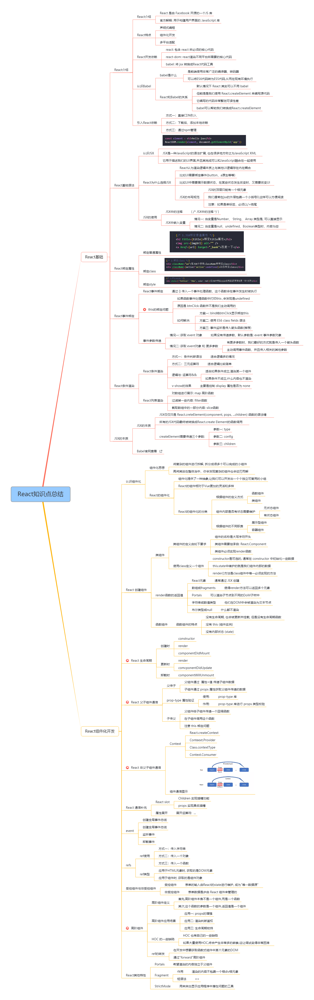

### vue和react
- vue的生命周期
  - 
  - 初始阶段
    - 初始化事件initEvent, 初始化生命周期initLifecycle
    - beforeCreate
    - initState()初始化注入和校验
    - created
  - 模板编译阶段
    - 先判断是否指定了"el"选项，是：是否指定template选项；否：调用vm.$mount(el)函数时判断是否指定template选项
    - 若指定了template，将template编译到render函数中渲染；若没有指定template，将el外部HTML作为template编译
  
    - 另一种渲染阶段的表述：
      - 模板编译成AST树
      - AST转换成render函数字符串
      - render函数字符串转换成VNode
  - 挂载阶段
    - beforeMount
    - 创建vm.$el替换el
    - mounted

    - 更新阶段
      - 当data发生变化
      - beforeUpdate 
      - 虚拟DOM重新渲染并应用更新
      - updated
      - 父子组件挂载顺序
  - 销毁阶段
    - 当调用vm.$destroy
      - beforeDestroy
      - remove 解除绑定，销毁子组件以及事件监听器
      - destroyed
- react的生命周期
  - 旧版 
  - 
    - 初始化阶段
      - setup props and state
      - 初始化属性对象
      - 初始化状态对象
    - 挂载阶段Mounting
      - 挂载：将虚拟DOM转为真实DOM的过程
      - componentWillMount: 挂载之前，在渲染过程中可能会执行多次，不建议使用
      - render：组件挂载
      - componentDidMount：组件挂载之后，永远只会执行一次，推荐在此阶段执行副作用，进行异步操作，比如发ajax请求，操作DOM
    - 更新阶段Updating
      - 属性更新props变化
        - componentWillReceiveProps：组件收到新的属性对象的调用，首次渲染不会触发
        - shouldComponentUpdate：询问组件是否更新 ； 参数：新的属性对象；返回：boolean值
        - componentWillUpdate：组件更新之前
        - render：根据新的属性对象重新挂载（渲染）组件
        - componentDidUpdate：组件更新完成
      - 状态更新state变化
        - shouldComponentUpdate：询问组件是否可以更新；参数：新的状态对象；返回boolean值
        - componentWillUpdate: 组件更新之前
        - render：根据新的状态对象重新挂载（渲染）组件
        - componentDidUpdate：组件更新完成
    - 卸载阶段Unmounting
      - componentWillUnmount：组件卸载之前调用
  - 新版
  - 
    - 创建时
      - constructor：初始化属性和状态
      - getDerivedStateFromProps：根据属性对象派生状态对象
        - 静态方法
        - 参数：新的属性对象，旧的状态对象
        - 用途：在没有这个生命周期之前，我们使用的数据可能时属性对象，也可能是状态对象，可以通过生命周期函数将属性对象派生到状态对象上，使我们在代码中只通过this.state.XXX来绑定我们的数据
      - render：挂载（渲染）组件
      - componentDidMount：组件挂载（渲染）完成
    - 更新时
      - getDerivedStateFromProps：根据属性对象派生状态对象
        - 静态方法
        - 参数：新的属性对象，旧的状态对象
      - shouldComponentUpdate：询问组件是否可以更新
        - 参数：新的状态对象
        - 返回：boolean值
      - render：根据新的状态对象重新挂载（渲染）组件
      - getSnapshotbeforeUpdate:获取更新前的旧照
      - componentDidUpdate：组件更新完成
    - 卸载时
      - componentWillUnmount：组件卸载之前
  
  - 1.数据获取为啥一定要放在componentDidMount里面调用？
    - constructor中
      - construct()获取数据的话，若时间太长，或者出错，组件就渲染不出来了，整个页面都无法渲染了
    - componentWillMount()
      - 1.如果使用SSR（服务端渲染）,componentWillMount会执行2次，一次在服务端，一次在客户端。而componentDidMount不会。
      - 2.React16之后采用Fiber架构，只有componentDidMount声明周期函数是确定执行一次的，类似componentWillMount的生命周期钩子都有可能执行多次，所以不加以在这些生命周期中做有副作用的操作，比如请求数据之类
    - componentDidMount()
      - 1.确保已经render过一次。提醒我们正确地设置初始状态，这样不会导致错误的undefined状态
      - 2.componentDidMount方法中的代码，是在组件已经完全挂载到网页上才会调用被执行，所以可以保证数据的加载。此外，在这方法中调用setState方法，会触发重渲染。所以，官方设计这个方法就是用来加载外部数据用的，或处理其他的副作用代码。
  - 新旧比较(废三增二)
    - 废弃了
      - componentWillMount
      - componentWillReceiveProps
      - componentWillUpdate
    - 增加了
      - getDerivedStateFromProps
      - getSnapshotbeforeUpdate

     
- 两者的区别（优缺点） [详细对比见](1001Vue和React区别.md)
  - 相同点：
    - 使用Virtual DOM，有自己的diff渲染算法
    - 提供了响应式（Reactive）和组件化（Composable）的视图组件
    - 将注意力集中保持在核心库，而将其他功能如路由和全局状态管理交给相关的库
  - 1.运行时性能比较
    - React和Vue都非常快，所以速度并不是在它们之中做选择的决定性因素。
    - 1.1 生命周期
      - 在React应用中，当某个组件的状态发生变化时，它会以该组件为根，重新渲染整个组件子树
      - Vue应用中，组件的依赖是在渲染过程中自动追踪的，所以系统能精确知晓哪个组件确实需要被重新渲染。
    - 1.2 状态管理 VS 对象属性
      - React在state状态管理存储数据的，不能修改数据，修改数据在setState中，setState是异步的，如果需要马上利用结果，需要在setState传入回调
      - Vue中，state对象并不是必须的，数据data属性在Vue对象中进行管理
  - 2. HTML & CSS
    - 在 React 中，一切都是 JavaScript。不仅仅是 HTML 可以用 JSX 来表达，现在的潮流也越来越多地将 CSS 也纳入到 JavaScript 中来处理。
    - Vue的整体思想是拥抱经典的Web技术，并在其上进行扩展
    - 2.1 JSX VS Template
      - react中，所有的组件的渲染功能都依赖JSX
      - vue中，则是将HTML模板、css、js嵌到一个vue文件中去
    - 2.2 组件作用域内的css
      - 对于Vue，设置样式的默认方法是单文件组件里类似 style 的标签。 单文件组件让你可以在同一个文件里完全控制 CSS，将其作为组件代码的一部分；scoped 唯一属性。
      - 对于React，语法不太一样，react设置class是用className字段，而设置css是使用对象的形式，当然，一般还是引入外部的css(经过编译的sass或者less文件)比较合适。
  - 3.规模
    - Vue 的路由库和状态管理库都是由官方维护支持且与核心库同步更新的。React 则是选择把这些问题交给社区维护，因此创建了一个更分散的生态系统。
- vue，首屏加载的优化
  - 1.使用CDN资源
    - 我们要将 vue、 vue-router、 vuex、element-ui 从 vendor.js 中分离出来，使用CDN资源引入。国内的CDN服务推荐使用 BootCDN。
    - 修改build/webpack.base.conf.js
    - 修改src/router/index.js
    - 修改src/store/index.js
    - 修改src/main.js
  - 2.Nginx开启gzip
  - 3.路由懒加载：把不同路由对应的组件分割成不同的代码块，然后当路由被访问的时候才加载对应组件，利用vue的异步组件和webpack的代码分割功能，实现路由组件的懒加载。
  - 4.组件懒加载
  - 5.利用webpack-bundle-analyzer分析器，分析项目依赖关系
    - 配置webpack 来分离 echarts
    - 针对体积比较大的一些钢需依赖，选择CDN加速的方式
- react，首屏加载的优化
  - 
- vuex都有哪些特性
  - [见vuex面试题](1002Vuex面试题.md)
- redux有哪些特性]
  - 见redux面试题
- vuex与redux之间的区别
  - 同样是状态管理库，Vuex和Redux的理念一摸一样
  - [区别详见](1002Redux和Vuex的对比.md)
- vue，在每个生命周期都能做哪些事情
  - [详见个人文档](vue面试1.md)
  - [参考博客](https://segmentfault.com/a/1190000011381906)
- react，在每个生命周期都能在做哪些事情
  - 看上面的react生命周期
  - 
  - react生命周期主要包括三个阶段：
    - 初始化阶段、运行中阶段（或更新时阶段）、销毁阶段
- vue的api
  - vue常用API
    - [Vue常用API](https://zhuanlan.zhihu.com/p/42974849)
    - Vue.extend()
    - Vue.filter()
    - Vue.set()
    - Vue.delete()
    - Vue.mixin()
    - Vue.directive()
- react的api
  - [一个参考](https://juejin.im/post/6844903938085355527)
  - React.Children()
  - React.createRef()
  - React.createContext()
  - 等
- vue的虚拟dom
  - [vue虚拟DOM参考博客](https://juejin.im/post/6844903895467032589)
  - [vue虚拟DOM源码解析](https://vue-js.com/learn-vue/filter/#_1-%E5%89%8D%E8%A8%80)
  - [本文档的学习](../vue/vue-2.6.11/vue_learn/虚拟DOM/0923虚拟DOM.md)
- react的虚拟dom
  - [react虚拟DOM参考博客](https://juejin.im/post/6844903529161850893)
- vue的diff算法
  - 见上一条中的diff分析
- react的diff算法
  - 见上一条中的diff分析
- vue的数据流动和页面渲染
  - 单向流动
  - 数据驱动页面渲染
- react的数据流动和页面渲染
  - 单向流动
  - 数据发生变化，导致也页面重新渲染
- vue-router，特性
  - [见vue-router面试题汇总](1003vue-router面试题.md)
- react-router，特性
  - [见react-router概览](1003react-router面试题.md)
- vue-router与react-router之间的比较
  - [vue-router和react-router之间的对照](https://juejin.im/post/6844904164531634190)
- 做过哪些vue的优化
  - [vue性能优化](1003vue性能优化.md)
- 做过哪些react的优化
- 看过vue的源码吗
  - 看过
- 看过react的源码吗
  - 没有
- vue异步编程实现
- react异步编程实现
- vue的组件传值
  - 父子，props， $parent, $children, $emit, 
    - 父传子：props, ref, $children
    - 子传父：this.$emit(), $parent
  - 兄弟，事件bus(EventBus)
  - 爷孙：$attrs, $listeners
  - provide/inject隔代组件传值（祖先组件传给其任意后代元素）
  - vuex
- react的组件传值
  - 父传子：props
  - 子传父：通过在父组件引入的子组件中传递一个函数并传参,子组件去触发这个函数更改参数完成数据更新
  - redux或者react-redux
  - 过上下文的形式做组件传值
- 知道react hook吗？
- 高阶组件hoc用过吗？哪些？ 
- vue懒加载
- React懒加载