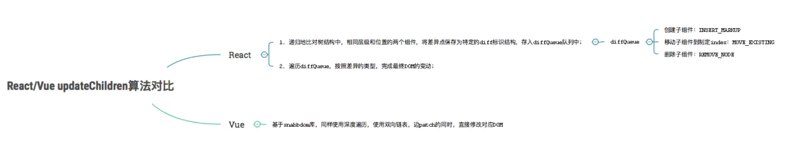
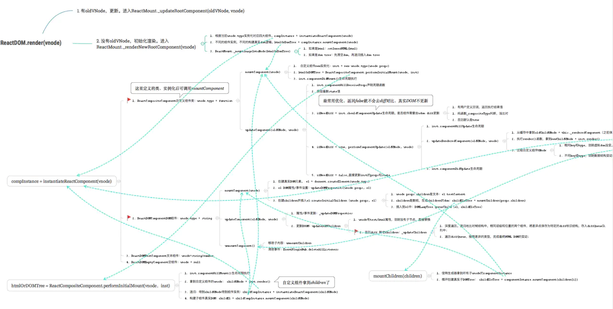

> [掘金：博客：个人理解Vue和React](https://juejin.im/post/6844904158093377549)

### 1.相同点

- 1.都是用Virtural DOM（虚拟DOM）
- 2.都使用组件化思想，流程基本一致
- 3.都是响应式，推崇单向数据流
- 4.都有成熟的社区，都支持服务端渲染

- Vue和React实现原理和流程基本一致，都是virtural DOM + Diff算法。

- Vue和React通用流程:
  - vue template/react jsx -> render函数 -> 生成Vnode -> mount挂载生成真实DOM -> 当data或props发生变化时，新老VNode diff -> diff算法对比，并真正去更新真实DOM

- 核心还是virtual DOM，React首创VDOM，Vue2.0引入了VDOM，为什么使用virtual DOM?
  - 1.减少直接操作DOM。同时也使得数据驱动视图
  - 2.为函数式UI编程提供可能（React核心思想）
  - 3.可以跨平台，渲染到DOM（web）之外的平台，比如ReactNative，Weex

### 2.不同点

#### 1.核心思想不同

- Vue早期定位是尽可能的降低前端开发的门槛，所以Vue推崇灵活易用（渐进式开发体验），数据可变，双向数据绑定（依赖收集）
- React早期口号是Rethinking Best Practices。而且React想要做的是用更好的方式去颠覆前端开发方式（事实上跟早期jquery称霸前端，的确是颠覆了）。所以React推崇函数式编程（纯组件），数据不可变以及单向数据流。函数式编程最大的好处是其稳定性（无副作用）和可测试性（输入相同，输出一定相同），所以通常大家说的React适合大型应用，根本原因还是在于其函数式编程。

##### 1.1 核心思想不同导致写法差异

- Vue推崇template，单文件vue
- React推崇JSX、HOC（高阶组件）、all in js

##### 1.2 核心思想不同导致api差异

- Vue定位简单易上手，基于template + options API，所以不可避免的有较多概念和api，比如：
  - template模板中需要理解slot、filter、指令等概念和api
  - options API中需要理解watch、computed(依赖收集)等概念和api

- react本质上核心只有一个Virtual DOM + Diff算法，所以api非常少。知道setState就能开始开发了

##### 1.3 核心思想不同导致社区差异

- 由于Vue定义简单易上手，能快速解决问题，所以很多常见的解决方案，是Vue官方主导开发和维护，比如：
  - Vuex
  - vue-router
  - 脚手架vue-CLI
  - Vutur等

- React只关注底层，上层应用解决方案基本不插手，连最基础的状态管理早期也只是给出flow单向数据流思想，大部分都丢给社区去解决。比如状态管理库方面，有redux、mobx、redux-sage、dva等一大堆（选择困难症犯了），所以这也造就了React社区非常繁荣。
  - 创造出React Hooks来替代HOC、Suspense

##### 1.4 核心思想不同导致未来升级方向不同

- Vue依然会定位简单易上手（渐进式开发），依然考虑通过依赖收集来实现数据可变
- React的函数式编程这个基本盘不会变
  - 从React Hooks可以看出，React团队致力于组件函数式编程，（纯组件，无class组件），尽量减少副作用（减少this，this会引起副作用）

#### 2. 组件实现不同

- Vue源码实现是把options挂载到Vue核心类上，然后再new Vue({options})拿到实例（vue组件的script导出的是一个挂满options的纯对象而已）。所以options api中的this指向内部Vue实例，对用户是不透明的，所以需要文档去说明this。slot、this.xxx这些api。另外Vue插件都是基于Vue原型类基础之上建立的，这也是Vue插件使用Vue.install的原因，因为要确保第三方库的Vue和当前应用的Vue对象是同一个。

- React内部实现比较简单，直接定义render函数以生成VNode，而React内部使用了四大组件类包装VNode，不同类型的VNode使用相应的组件类处理，职责划分清晰明了（后面的Diff算法也非常清晰）。React类组件都是继承自React.Component类，其this指向用户自定义的类，对用户来说是透明的

#### 3. 响应式原理不同

- Vue
  - Vue依赖收集，自动优化，数据可变
  - Vue递归监听data的所有属性，直接修改
  - 当数据改变时，自动找到引用组件重新渲染

- React
  - react基于状态机，手动优化，数据不可变，需要setState驱动新的State替换老的State
  - 当数据改变时，以组件为根目录，默认全部重新渲染

#### 4. Diff算法不同

- 两者流程思维是类似的，都是基于2个假设（使得算法复杂度将为O(n)）:
  - 1.不同的组件产生不同的DOM结构。当type不相同时，对应DOM操作直接销毁老的DOM，创建新的DOM
  - 2.同一层次的一组子节点，可以通过唯一的key区分

- 两者源码实现上有区别：
  - Vue基于snabbdom库，它有较好的速度以及模块机制。Vue Diff使用双向链表，边对比，边更新DOM
  - React主要使用diff队列保存需要更新哪些DOM，得到patch树，再统一操作批量更新DOM

#### 5.事件机制不同

- Vue
  - 1.Vue原生事件使用标准Web事件
  - 2.Vue组件自定义事件机制，是父子组件通信基础
  - 3.Vue合理利用了snabbdom库的模块插件

- React
  - 1.react原生事件被包装，所有事件都冒泡到顶层document监听，然后在这里合成事件下发。基于这套，可以跨端使用事件机制，而不是和web DOM强绑定
  - 2.React组件上无事件，父子组件通信使用props

### Vue 和 React源码流程图

- Vue 整体流程图

- React 整体流程图
