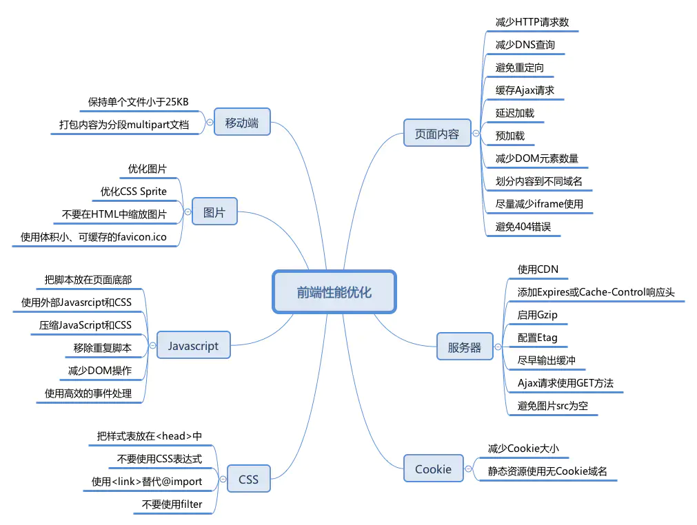

> [参考博客地址](https://juejin.im/post/6844904189999448071)
- 前端优化主要靠2点：
  - 缓存
  - 网络强弱

- vue通过数据双向绑定和虚拟DOM技术，解决了操作真实DOM的问题


### 1.代码层面的优化

#### 1.1 computed和watch区分使用场景
- computed：是计算属性，依赖其他属性值，并且computed的值有缓存，只有它依赖的属性值发生改变，下一次获取computed的值时才会重新计算computed的值。

- watch： 更多的是「观察」的作用，类似于某些数据的监听回调 ，每当监听的数据变化时都会执行回调进行后续操作
当我们需要进行数值计算，并且依赖于其它数据时，应该使用 computed，因为可以利用 computed 的缓存特性，避免每次获取值时，都要重新计算；

- 当我们需要在数据变化时，执行异步或者开销较大的操作时，应该使用watch

#### 1.2 v-for 和v-if不要连用
- 避免在v-for里面嵌套v-if
- v-for 遍历必须为 item 添加 key 在列表数据进行遍历渲染时，需要为每一项 item 设置唯一 key 值，方便 Vue.js 内部机制精准找到该条列表数据。当 state 更新时，新的状态值和旧的状态值对比，较快地定位到 diff 

#### 1.3 长列表性能优化
- Vue会通过Object。defineProperty对数据进行劫持，来实现视图响应数据的变化
- 当组件就是纯粹的数据展示时，不需要Vue来劫持数据，在大量数据展示情况下，这能很明显的减少组件初始化的时间。
- 通过Object.freeze()来冻结一个对象，使之不能被修改

```js
    export default {
        data: () => ({
            users: {}
        }),
        async created() {
            const users = await axios.get("/api/users");
            this.users = Object.freeze(users)
        }
    };
/*
优化无限列表性能
参考https://www.cnblogs.com/imwtr/p/10428819.html
大列表两个核心 一个分段一个区分
具体执行分为
 仅渲染视窗可见的数据
 进行函数节流
 减少驻留的VNode和Vue组件，不使用显示的子组件slot方式，改为手动创建虚拟DOM来切断对象引用
*/
```

#### 1.4 事件销毁
- Vue组件销毁时，会自动清理它与其他实例的连接，解绑它的全部指令及监听器，但仅限于组件本身。
- 如果js内部使用了addEbventListener等方式是不会自动销毁的，我们需要在组件销毁时手动移除这些事件的监听，以免造成内存泄漏

```js
    create() {
        addEventListener('click', this.click, false)
    },
    beforeDestroy() {
        removeEventListener('click', this.click, false)
    }
```

#### 1.5 路由懒加载

```js
const Foo = () => import('./Foo.vue')
const router = new VueRouter({
  routes: [
    { path: '/foo', component: Foo }
  ]
})

```

### 1.6 第三方插件的按需引入
- 借助babel-plugin-component，然后可以只引入需要的组件，以减少项目体积的目的
- 以下为项目中引入 element-ui 组件库为例： 
  - 1）首先，安装 babel-plugin-component npm install babel-plugin-component -D 
  - 2）然后，将 .babelrc 修改为：

  ```js
    {
       "presets": [["es2015", { "modules": false }]],
        "plugins": [
            [
            "component",
            {
                "libraryName": "element-ui",
                "styleLibraryName": "theme-chalk"
            }
            ]
        ]

    }
  ```
  - 3)在main.js中引入部分组件：

  ```js
    import Vue from 'vue';
    import { Button, Select } from 'element-ui';

    Vue.use(Button)
    Vue.use(Select)
  ```

#### 1.7 服务端渲染SSR
- 服务端渲染：Vue在客户端将标签渲染成整个html片段的工作在服务端完成，服务端形成的html片段直接返回给客户端的过程。

- 服务端渲染优点：
  - 更好的 SEO： 因为 SPA 页面的内容是通过 Ajax 获取，而搜索引擎爬取工具并不会等待 Ajax 异步完成后再抓取页面内容，所以在 SPA 中是抓取不到页面通过 Ajax 获取到的内容；而 SSR 是直接由服务端返回已经渲染好的页面（数据已经包含在页面中），所以搜索引擎爬取工具可以抓取渲染好的页面；

  - 更快的内容到达时间（首屏加载更快）： SPA 会等待所有 Vue 编译后的 js 文件都下载完成后，才开始进行页面的渲染，文件下载等需要一定的时间等，所以首屏渲染需要一定的时间；SSR 直接由服务端渲染好页面直接返回显示，无需等待下载 js 文件及再去渲染等，所以 SSR 有更快的内容到达时间

- 服务端渲染的缺点：
  - 更多的开发条件限制： 例如服务端渲染只支持 beforCreate 和 created 两个钩子函数，这会导致一些外部扩展库需要特殊处理，才能在服务端渲染应用程序中运行；并且与可以部署在任何静态文件服务器上的完全静态单页面应用程序 SPA 不同，服务端渲染应用程序，需要处于 Node.js server 运行环境；nuxt框架


### 2.Webpack层面的优化

#### 2.1 减少ES6转为ES5的冗余代码

- 安装 babel-plugin-transform-runtime ：

#### 2.2 提取公共代码

#### 2.3 模板预编译
- 如果你使用 webpack，并且喜欢分离 JavaScript 和模板文件，你可以使用 vue-template-loader，它也可以在构建过程中把模板文件转换成为 JavaScript 渲染函数

#### 2.4优化SourceMap

#### 2.5构建结果输出分析

#### 2.6 通过tree-shaking，将没有使用的模块筛掉。这样来达到删除无用代码的目的

### 3.基础web优化技术
- 常用的 开启GZIP 浏览器缓存 CDN的使用 使用 Chrome Performance 查找性能瓶颈
  
