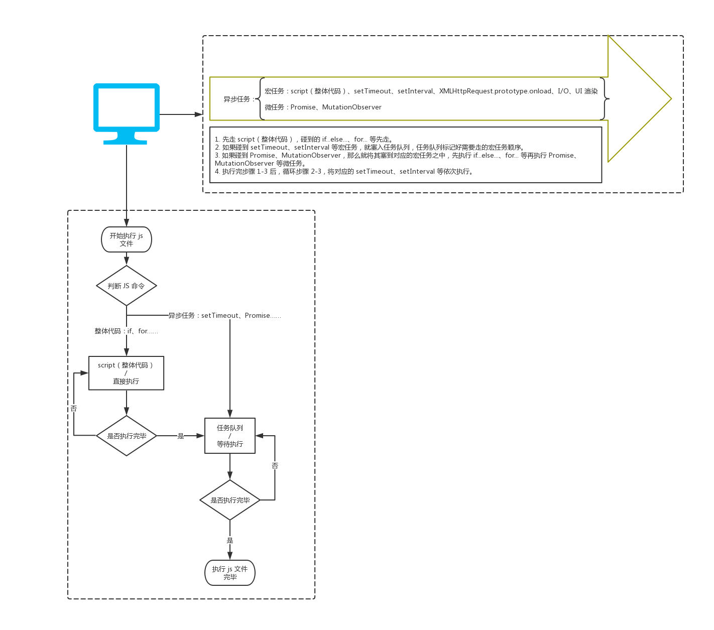

> [面试题经典-Event Loop- 掘金](https://juejin.im/post/6844904021296316429)

- Event Loop：解释Event Loop产生原因
- 浏览器 Event Loop：解惑工作困扰和扩展必备面试知识点
- Node.js Event Loop：进一步探索浏览器和node.js中event loop的不同

## 1.Event Loop

### 1.1什么是Event Loop，为什么需要Event Loop？
- 首先，JavaScript是单线程的。意味着所有任务都需要排队，前一个任务结束，才会执行后一个任务。

- 主线程从“任务队列”中读取执行事件，不断循环重复的过程，就称为事件循环Event Loop

- 然后，若前一个任务耗时很长后一个任务就得等着，我们不希望这样执行

- 为了协调事件event、用户交互user interaction、脚本script，渲染rendering、网络networking等，用户代理user agent必须使用事件循环event loops。

- node.js：node.js的event loop是基于libuv。libuv已经对Event Loop做出了实现
- 浏览器：浏览器的Event Loop是基于HTML5规范的。而 HTML5 规范中只是定义了浏览器中的 Event Loop 的模型，具体实现留给了浏览器厂商。

- let 在 for 中形成了独特的作用域块，当前的i只在本轮循环中有效，然后setTimeout会找到到本轮最接近的i，从而做出正确的输出

- var定义的变量，会污染全局变量，在for的外层还可以看到i的值。

- JavaScript 在碰到 setTimeout 的时候，会将它封印进异次元，只有等所有正常的语句（if、for……）执行完毕后，才会将它从异次元解封，输出最终结果。

## 2.浏览器

- Javascript的运行机制：
  - 1.所有同步任务都在主线程上执行，形成一个“执行栈”（execution context stack）。
  - 2.主线程之外，存在一个任务队列（task queue），在走主流程时，若碰到异步任务，那么任务队列中push这个异步任务。
  - 3.一旦“执行栈”中所有同步任务执行完毕，系统就会读取“任务队列”，看看里面存在哪些事件。哪些对应的异步任务，结束等待状态，进入执行栈，开始执行。
  - 4.主线程不断重复上面三个步骤

- Javascript的异步任务还分为：
  - 宏任务：Macrtask，script、setTimeout、setInterval、XMLHttpRequest.property.onload、I/O、UI渲染
  - 微任务：Microtask，Promise、MutationObserver

- 总结：
  - 1.你可以了解宏任务和微任务的大体执行，例如先走 if...else...，再走 Promise……但是，详细到每个 point 都记下来，这里不推荐。大人，时代在进步，记住死的不如多在业务实践中尝试，取最新的知识
  - 2.浏览器的Event Loop和Node.jsEvent Loop 不同，万一哪天 XX 小程序搞另类，有自己的 Event Loop，你要一一记住吗？

### 3.Node.js Event Loop

- Node 端事件循环中的异步队列也是这两种：Macrotask（宏任务）队列和 Microtask（微任务）队列。

- 常见的 Macrotask：setTimeout、setInterval、setImmediate、script（整体代码）、 I/O 操作等。
- 常见的 Microtask：process.nextTick、new Promise().then(回调) 等。

- 探索了一遍 Node.js 的 Event Loop 啦，但是因为咱还成就不了 Node.js 工程师，所以咱就不对其进行详细探索，以免和浏览器的 Event Loop 混淆了

> [其他参考博客-掘金](https://juejin.im/post/6844903832762187783)
