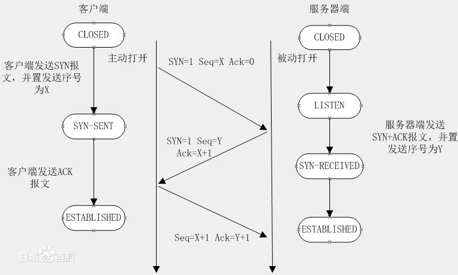

* 网络基础
  - TCP/IP分层管理
  - 基于浏览器的连接处理（在浏览器上输入URL到页面渲染的过程）
* HTTP的主要特点
* HTTP报文的组成部分
* HTTP方法
* GET和POST请求的区别
* 常见的状态码
* 什么是持久化
* 什么是管线化

### 网络基础

- TCP/IP的分层管理
  * TCP/IP最重要的一个特点就是分层管理，分别是：
    - 应用层————决定先用户提供应用服务时的通信活动，http，ftp， dns属于这一层
    - 安全层（TSL/SSL）————如果是https的请求会存在这一层，http的请求则无此层，注意
    - 传输层————传输层对于上层应用层提供处于网络连接中两台计算机之间的数据传输
    - 网络层————网络层用来处理网络上流动的数据包，数据包是网络传输的最小数据单位
    - 链路层————用来处理连接网络的硬件部分，包括控制操作系统、硬件的设备驱动等物理可见部分

  * 问：基于浏览器的连接处理（浏览器从输入url到页面渲染出来的过程）
    - 1.浏览器从url中解析出服务器的主机名
    - 2.浏览器将服务器的主机名转换成服务器的IP地址（DNS）
    - 3.浏览器将端口号从url中解析出来
    - 4.浏览器建立一条与web服务器的TCP连接
    - 5.浏览器向服务器发送一条HTTP的请求报文
    - 6.服务器向浏览器回送一条HTTP的响应报文
    - 7.浏览器渲染，关闭连接
  
  * 问：浏览器建立一条与web服务器的TCP连接时多了哪些事（三次握手/四次挥手）？或者会追问浏览器的渲染过程是什么样？又或者是TCP的作用是啥？
  
    
  
    - 三次握手
      * 1.客户端首先发送一个带有SYN标志的数据包给服务器  [SYN：同步序列编号（Synchronize Sequence Numbers）。是TCP/IP建立连接时使用的握手信号]
      * 2.服务端接受SYN数据包之后，回传一个SYN/ACK标志的数据包，表示传达确认连接信息
      * 3.客户端接受到SYN/ACK的确认数据包之后，再回传一个ACK标志的数据包给服务端表示‘握手’结束
      * [ACK (Acknowledge character）即是确认字符，在数据通信中，接收站发给发送站的一种传输类控制字符。表示发来的数据已确认接收无误]

    - 四次挥手
      * 1.客户端向服务端先发送一个带有FIN标志的数据包给服务端
      * 2.服务端接受FIN数据包之后，回传一个ACK的数据包给客户端，表示传达确认关闭信息
      * 3.服务端向客户端发送一个FIN标志的数据包，请求关闭连接
      * 4.客户端收到FIN的数据包之后，回传一个ACK的数据包给服务端，表示确认关闭

    - TCP的作用（了解）
      * 1.提供无差错的数据传输
      * 2.按序传输
      * 3.未分段的数据流（可以在任意时刻以任意尺寸将数据发送出去）

    - 浏览器的渲染过程
      * 1.html元素转成DOM tree
      * 2.css样式转成 CSS tree
      * 3.DOM tree和CSS tree整合形成Render tree
      * 4.通过layout计算DOM元素要显示的位置和样式
      * 5.浏览器进行绘制渲染

### HTTP的主要特点
  - 简单快速
  - 灵活
  - 无连接————http协议连接一次后就会断开，不会保持连接
  - 无状态————可以理解为服务端和客户端是两种身份，单从http协议中是无法区分两次协议者的身份

### HTTP报文的组成部分

- 请求报文：
  * 请求行————包含http方法，页面地址，http协议，http版本
  * 请求头————包含一些key：value的值，eg：host、Cache-Conctrol、Accept、Cookies等
  * 空行————用来告诉服务器端往下就是请求体的部分了
  * 请求体————正常的query/body参数
- 响应报文：
  * 状态行————包含http方法，http协议，http版本，状态码
  * 响应头————包含一些key: value的键值对，eg：Content-type，Set-cookies，CacheControl，Date，Server
  * 响应体————就是服务器返回的数据

### HTTP方法

- GET——获取资源
- POST——传输资源
- PUT——更新资源，传用来传输文件
- DELETE——删除资源
- HEAD——获取请求报文首部
- OPTIONS——询问支持的方法，查询针对请求URL指定的资源支持的方法

### GET和POST请求的区别

* GET产生的URL地址可以被收藏，而POST不可以
* GET请求会被浏览器主动缓存，而POST不会，除非自动设置
* GET请求参数会被完整的保留在浏览器历史里，而POST的参数不会被保留
* GET请求在URL中传输参数有长度限制，而POST没有
* 对参数的数据类型，GET只接受ASCII字符，而POST没有限制
* POST比GET更安全，因为GET请求的参数直接暴露在URL上
* GET参数通过URL传输，POST参数放在request body中

### 常见状态码

- 1XX --- 指示信息，表示请求已接受，继续处理
- 2XX --- 成功，表示请求已被成功接受
  - 200 --- OK，客户端请求成功
  - 206 --- 客户端发送了一个带有Range头的GET请求，视频/音频可能会用到
- 3XX --- 重定向，要完成请求，必需进行近一步操作
  - 301 --- 重定向，所请求的界面转移到新的url，永久重定向
  - 302 --- 同上301，但是是临时重定向
  - 304 --- 缓存，服务端告诉客户端有缓存可用，不用重新请求
- 4XX --- 客户端错误，请求有语法错误或请求无法实现
  - 400 --- Bad Request， 客户端请求有语法错误
  - 401 --- Unauthorized, 请求未授权
  - 403 --- Forbidden, 禁止页面访问
  - 404 --- Not found， 请求资源不存在
- 5XX --- 服务端错误，服务器未能实现合法的请求
  - 500 --- Internal Server Error, 服务器错误
  - 503 --- Server Unavailable, 请求未完成，服务器临时过载或者宕机，一段时间后可恢复正常

### 什么是持久化

- 当使用Keep-alive模式（又称持久连接，连接重用 http1.1的版本才支持）时，Keep-alive 功能使客户端到服务端的连接持续有效，当出现服务器的后续请求时，Keep-alive 避免了建立或者重新建立连接

### 什么是管线化

- 在使用持久连接的情况下，某个连接上的消息传递类似于：
  - 请求1 --> 响应1 --> 请求2 --> 响应2 --> 请求3 --> 响应3
- 管线化的连接消息传递是类似于：
  - 请求1 --> 请求2 --> 请求3 --> 响应1 --> 响应2 --> 响应3
  - 相当于客户端一次性把所有的请求打包发送给服务端，同时服务端也一次性打包将所有的返回回传回来
  - 只有GET和HEAD请求可以进行管线化，而POST有所限制
  - 管线化是通过持久连接完成的，且只有http / 1.1 版本支持