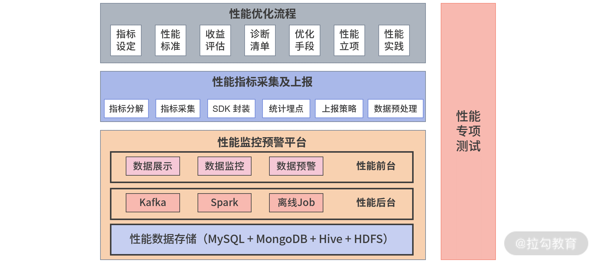

- 面试，问道前端优化？
  - 遇到了什么性能问题？围绕什么样的性能指标？采取了哪些性能优化手段？取得了什么样的结果？

- 希望前端和后端一样，通过查日志就能定位平台问题，而不是停留在猜测层面？
  - 性能监控平台
    - 能直接判断当前性能数据有没有问题，然后提示问题是出在前端、后端还是网络层。

- 职业发展问题
  - 前端工程化
    - 编译打包发布流程、物料中心、组件化
  - 体验领域
    - 性能优化方向

- 性能优化体系就是前端技术专家的心理表征

- 前端性能优化学习中的难点？
  - 1.成体系的性能优化资料严重缺失？
    * 缓存请求、服务端响应优化、页面解析与处理、静态资源优化
    * 使用这种优化方式的目的是什么？围绕什么指标做的优化，优化完成有什么收益？
  - 2.性能监控预警平台需要自己去开发
    * 性能优化的一个重中之重在于性能监控预警平台
  - 3.实践中有许多坑，别人并不会公开分享
  - 4.性能优化立项沟通
    * 性能优化中的立项是个难题
    * 如何从业务的角度来思考性能优化的价值
    * 并说服业务去发起这个项目
    * 正推，性能线索->性能问题->性能优化方案->性能收益
    * 反推，预估需要的性能收益->性能优化方案->性能问题->性能线索

- 性能优化理论是高阶知识
  - 前端性能优化方法论
  - 指标采集上报及优化手段
  - Hybrid下的进阶优化
  - 性能优化数据及预警
  - 一线大厂性能优化体系演进

- 模块一：性能优化方法论
  - 性能优化整个体系是怎么样的
  - 在页面加载过程中都有哪些性能瓶颈
  - 如何进行业务收益计算

- 模块二：指标采集上报及优化手段
  - 优化实战过程中，如何确定性能指标
  - 如何采集上报，尤其是首屏时间的度量是业界的难题
  - 为什么要使用MutationObserver这种方法做采集
  - 为什么要采集所有图片的加载时间

- 模块三：性能问题诊断及优化手段
  - 如何根据性能平台问题结合一些检查清单（如全量VS增量、同步VS异步、实时VS缓存、原片VS压缩）来诊断性能问题

- 模块四：Hybrid下的进阶优化
  - APP端内的性能优化难度会更大
  - 跨APP和H5之间，如果不了解Hybrid的知识，优化收益会非常有限

- 模块五：一线大厂性能优化体系演进
  - 腾讯、美团首屏优化优缺点
  - 小程序环境中怎么设定性能指标
  - 在ReactNative环境下如何优化渲染性能

- 强大的性能优化思考框架
- 丰富的实践方案
- 业界实现方案及演进
- 晋升和面试的法宝

---

> 性能优化体系与关键指标设定

- 前端性能优化一般比较繁琐，怎么优化？

- 

- 第二部分，性能指标采集与上报
  - 主要内容是把前面提到的性能以代码的形式分解落地确保可以采集，然后在SDK封装后集合统计埋点最后根据实际情况，指定上报策略。

- 出现一个6.18活动页加载数据卡顿的性能问题，我们想要优化它，那该怎么做？
  - 首先确定它的性能指标及其标准
  - 接下来该围绕什么来开展性能优化

- 什么样的指标值得我们关注？
  - 可衡量，就是可以通过代码来度量
  - 关注以用户为中心的关键结果和真实体验

- 视觉稳定性指标 （比较前沿）
  - CLS（Cumulative Layout Shift）,就是偏移量。
  - 采集方法依赖google的工具

- 交互方面
  - FID指标，首次输入延迟，指标必须尽量小于100ms
  - PSI，视觉变化率，衡量标准是小于20%

- 什么是白屏时间？
  - 指的是从输入内容回车（包括刷新、跳转等方式）后到页面开始出现第一个字符的时间
  - 标准300ms
  - 导致白屏时间长的原因？
    - DNS查询时间长
    - 建立TCP请求连接太慢
    - 服务器处理请求速度太慢
    - 客户端下载、解析、渲染时长过长
    - 没有做Gzip压缩
    - 缺乏本地离线化处理
    - 等等

- 首屏时间是怎么计算的？
  - 首屏时间 = 白屏时间 + 渲染时间
  - 从浏览器输入地址并回车，到首屏内容渲染完毕的时间，这个期间不需要滚动鼠标或者下拉页面，否则无效

- 秒开率，即1s内打开用户的占比

- 首屏时间毕竟粒度太粗
  - 首屏时间可以拆分为白屏时间、数据接口响应时间、图片加载资源等
  - 白屏时间数据接口响应时间可以直接从后端服务中获取不需要前端再重复计算

- 总结：
  - 进行性能优化，指标就是我们的一个抓手，首先就要确定它的指标，然后才能根据指标去采取措施，否则就会像无头苍蝇一样乱撞，没有执行目标
