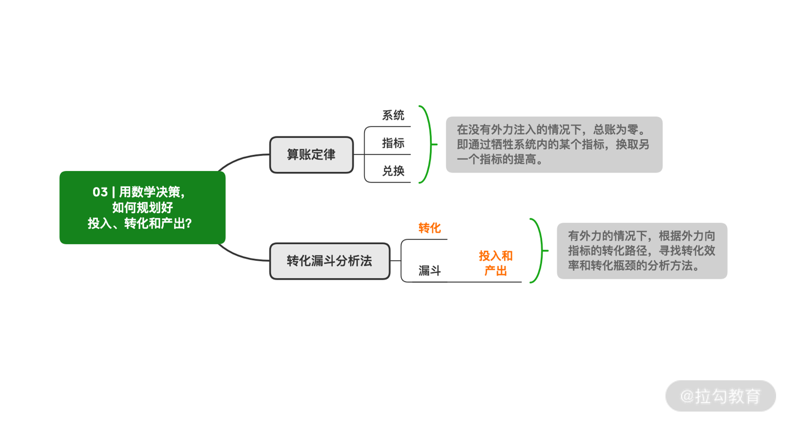

- 数制转换
  - 详解不同数制之间的巧妙联系，并重新思考数制与编程、计算机的关联
  - 例如：如何利用二进制的位运算，对一个查找问题的代码进行优化等内容

- 数制转换方法
  - 换基法（换向十进制）
  - 除宇法（十进制换向其他进制）
  - 按位拆分法和按位合并法（对于八进制和二进制之间得转换，可以利用十进制做跳板，将八进制转换为二进制）

- 例题：判断一个整数a，是否是2的整数次幂？
  - 解析：如果是十进制，判断一个数是否是10的整数次幂，只需要看这个数字的形式是否为一个1和若干个0构成。
  - 例如一个1和2个0构成100，他是10的2次幂，一个1和4个000，他是10的4次幂
  - 所以：
  ```python
    // 把a转为二进制
    a = 8
    b = str(bin(a)) // 0b xxx

    total = 0
    for i in range(2, len(b)):
      total += int(b[i])

    if total == 1 and b[2] == '1':
      print 'yes'
    else:
      print 'no' 
  ```

  - 解法二，利用位运算符
  ```python
    a = 80
    if a & (a-1) == 0:
      print 'yes'
    else:
      print 'no'
  ```

  - js写法
  ```js
    let func = function (a) {
    if ((a & (a-1)) === 0) {
        console.log('yes')
    } else { console.log('no')}}
    let a = 80;
    func(a); // no
    func(32); // yes
  ```

- MECE原则，提升逻辑思维水平
  - 相互独立，完全穷举
  - Mutually Exclusive Collectively Exhaustive
  - 不重叠、不遗漏、兼顾排他性和完整性

- 一定要注意所有边界值的可能性，原则上，每个可行值（尤其是边界值）能且只能落在一个策略分支中。

- 用数学决策，如何规划好投入、转化和产出？
  - 算账定律
  - 转化漏斗分析法



- 算账定律：对于一个没有外部力量作用的系统，它的总账为0。相反，如果一个系统受到外部力量，那么总账就可能不是0了。

- 关键要素： 系统、指标和兑换


- 转化漏斗分析法
  - 转化：是一个动作，表示的是外部力量转化为指标的动作过程。
  - 漏斗，代表了效率，即转化过程的投入和产出分别是多少。


- 数学在实际生活中的应用
  - 双十一关于钱的计算
  - 万有引力与好人缘
  - 修炼学习还是延时工作
  - 每天进步一点点问题
