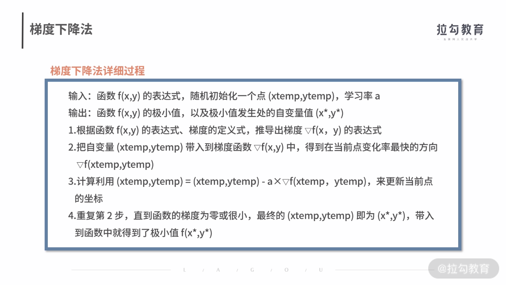

### 求极值：如何找到复杂业务的最优解？

- 求导法
- 梯度下降法

---

- 形式化定义
  - 就是用函数去表达需要文字描述的问题。也就是说，在做决策之前，需要把你的动作、收益、风险用函数建立联系。
- 追逐收益最大化”就是求解这个函数的最值，可能是最大值、也可能是最小值

- [示例求导法](./getSubsidy.py)

- 然而实际业务环境中，遇到的往往是非常复杂的函数。假设p(x)=2/(1+e-x) -1，此时的
  - r(x) = p(x)*(m-x-c) = (2/(1+e-x)-1)*(16-x-8)
  - 然而对这个函数求一阶导过于复杂，所以我们使用梯度下降法

- 梯度下降法
  - 对于一个函数，它的导数的含义就是斜率。某个函数f(x)，在某个点x0的倒数f'(x)=k0。那么k0就是这一点的斜率。
  - 如果k0为正数，那么函数值在 x0 附近就是呈现“上升”趋势；反之，如果 k0 是负数，函数值在 x0 附近就是呈现“下降”趋势。
  - 通过这个性质，我们可以通过多轮迭代，逐步去逼近函数的极值点。

- 对于函数 f(x,y)，常用 ▽f(x,y) 来表示函数的梯度。其中 x、y 表示函数有两个或多个自变量，是个多元函数。梯度本身是个向量，表示的是函数在自变量构成的空间中，变化率最快的方向。

- 梯度下降法
  - 

- [示例梯度下降法](./grad.py)